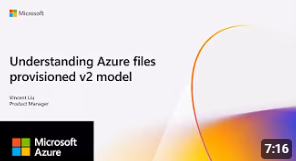

# What's up : )

- I’m Vincent, a Product Manager at **Microsoft** working on **Azure Files** and **Azure File Sync**.  
- I focus on **file share management**, **product documentation**, **customer advocacy**, and making storage simpler and more cost‑efficient.

## Talks
<table>
    <tr>
        <td></td>
        <td>
            <h3><a href="https://www.youtube.com/watch?v=tIWap2KLK8M">Simplifying Azure Files: Provisioned v2 and Microsoft.FileShares</a></h3>
            <h4>
                Will Gries, Vincent Liu 
                2025-11-18
            </h4>
        </td>
    </tr>
    <tr>
        <td>
        </td>
        <td>
            <h3><a href="https://www.youtube.com/watch?v=fnxEFw4mMyQ">Azure Files Provisioned v2 Pricing Model: Flexible and Cost Efficient File Shares</a></h3>
            <h4>
                Vincent Liu  
                2025-05-30
            </h4>
        </td>
    </tr>
   
</table>

---

## Blog posts
| Title | Author | Date |
|-|-|-|
| [Simplifying file share management and control for Azure Files](https://techcommunity.microsoft.com/blog/azurestorageblog/simplifying-file-share-management-and-control-for-azure-files/4452634) | Will Gries (Coauthor: Vincent Liu) | 2025-09-09 |
| [Lower costs and boost flexibility with Azure Files provisioned v2](https://techcommunity.microsoft.com/blog/azurestorageblog/lower-costs-and-boost-flexibility-with-azure-files-provisioned-v2/4443621) | Will Gries (Coauthor: Vincent Liu) | 2025-08-14 |
